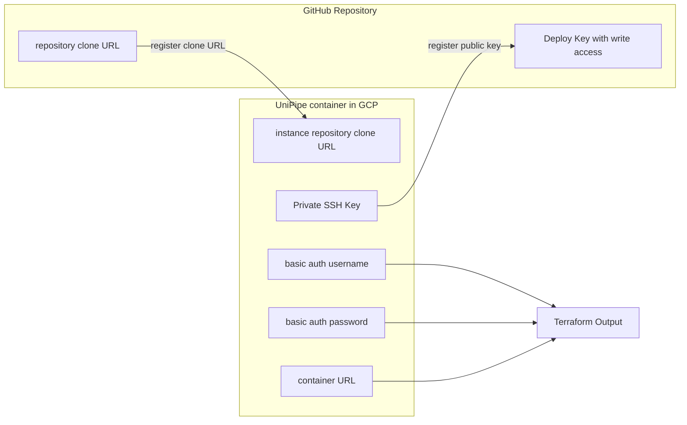

# Standard deployment with GitHub integration

This example spins up an UniPipe service broker with a GitHub repository as instance repository.

## How to use this example

Replace all occurrences of "..." with proper values.

Run `terraform apply`.
